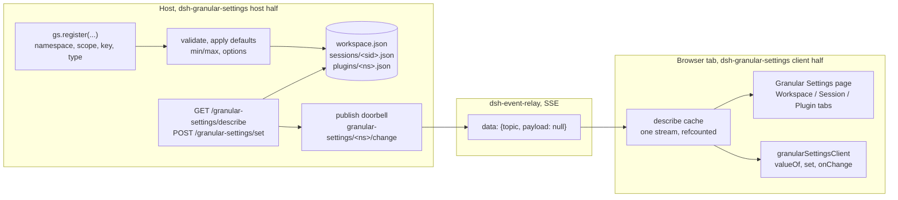

# dsh-granular-settings

A [DeepSeek Harness](https://github.com/deepseek-ai/deepseek-harness) (DSH)
plugin: install it into a profile alongside your own plugins.

**Settings that other plugins contribute.** Plugins need knobs at more than
one granularity: a model choice for this session, a build flag for the whole
workspace, an accent color for the entire install. This plugin is the shared
platform for all of them. One registration API, nine control types, three
scopes. One Granular Settings page renders everything, grouped one box per
plugin, so users never hunt through a settings maze built by N different
authors.

Every registration is namespaced by the owning plugin's package name, so
`enabled` from `dsh-foo` and `enabled` from `dsh-bar` are different settings
in different namespaces. Generic keys are safe; collisions cannot happen.

## Architecture



## Three scopes, one page

| scope | value lives | storage |
|---|---|---|
| `session` | one value per session | `<workspace>/.dsh/settings/sessions/<sid>.json` |
| `workspace` | one value per workspace, shared by its sessions | `<workspace>/.dsh/settings/workspace.json` |
| `global` | plugin-wide, unrelated to any workspace or session | `~/.dsh/settings/plugins/<namespace>.json`, one flat file per plugin, served from a boot-hydrated in-memory cache |

The settings-dialog page has three tabs, Workspace, Session, Plugin, one per
scope, rendered by the same components. It works with no session open: the
Plugin tab is the only scope that exists without a session context. A
Granular Settings view tab can also sit beside Chat in each session; it
renders the same page, and its visibility is itself a plugin setting,
default on.

## Plugin value proposition

| alternative | falls short |
|---|---|
| every plugin ships its own settings UI | N surfaces in N styles; users hunt; every author re-solves rendering, validation, persistence, and sync |
| a config file or environment variables | no UI, no live apply; edits made while the harness runs are overwritten or missed |
| one global key-value store | no scoping; a per-session toggle or a per-workspace path cannot exist |
| localStorage | values live in one browser profile, never reach the host or another machine |
| host RPC alone | correct but raw: every plugin rebuilds caching, default fallback, and change push |

## How to install

Requires a DeepSeek Harness checkout, a profile, here `web`, and
dsh-event-relay, whose stream carries the live-update doorbells:

```sh
# from the harness checkout
pnpm dsh plugin --profile web add /path/to/dsh-event-relay
pnpm dsh plugin --profile web add /path/to/dsh-granular-settings

# verify the profile still composes
pnpm dsh --profile web --dump-config
```

Then restart the harness. The Granular Settings page appears in the settings
dialog; nothing else to wire up.

## Contributors (host plugins)

```js
const gs = ctx.get('granularSettings')            // hard dep: inject it
const s = gs.register({
  namespace: 'my-plugin',       // REQUIRED: package name, [a-z][a-z0-9-]*, stable identity
  scope: 'session',             // 'session' | 'workspace' | 'global'
  key: 'model',                 // [a-z][a-z0-9-]*, unique only within the namespace
  type: 'enum',                 // see control types below
  label: 'Model',
  owner: 'My Plugin',           // display name for the settings box
  description: 'Which model this session uses',
  options: [{ value: 'a', label: 'Model A' }],   // enum and multiselect only
  defaultValue: 'a',
  onChange: (value, target) => {},                // optional, serialized after persist
})

await s.get(sessionIdOrWorkspacePath)   // target: sessionId, workspace path, or ignored for global
await s.set(sessionIdOrWorkspacePath, 'b')
s.dispose()
```

Control types and their metadata:

| type | value | registration extras |
|---|---|---|
| `toggle` | boolean | |
| `text` | string, max 4000 chars | |
| `color` | hex string | |
| `number` | finite number | optional `min`, `max` |
| `slider` | number | required `min`, `max`, `step` |
| `enum` | one option value | required `options` or a provider function |
| `multiselect` | array of option values | required `options` or a provider function |
| `keybind` | combo string like `Ctrl+Alt+K` | |
| `path` | absolute directory string | |

For `enum` and `multiselect`, `options` may instead be a zero-argument
function evaluated at describe time, so an option list can track a live
library without re-registration. A stored value that vanished from the
current list falls back to the first current option, never a value the UI
cannot render.

## Consumers (browser bundles)

Browser plugins inject `granularSettingsClient` and never touch fetch, relay
topics, or wire shapes:

```js
const gs = ctx.get('granularSettingsClient')
const cacheKey = sessionId || ''                        // '' is the sessionless context

gs.ensure(cacheKey)                                     // ask for one context's settings
gs.loaded(cacheKey)                                     // render gate, avoids default flash
gs.valueOf(cacheKey, 'my-plugin', 'session', 'model')   // value with default fallback
gs.set(cacheKey, 'my-plugin', 'session', 'model', 'b')  // optimistic write, same path the page uses
const off = gs.onChange(cacheKey, () => refetch())      // doorbell, reconnect, focus, set echo
gs.release(cacheKey)                                    // unmount drops one want, refcounted
```

One describe stream is shared by the page and every consumer: concurrent
fetches coalesce, and a want that failed at boot, while host plugins were
still loading, is retried on the next doorbell or focus.

Whole tabs can be contributed too, when rows are not enough:

```js
const off = gs.registerTab({ id: 'my-tab', label: 'My Plugin', order: 40 }, MyComponent)
```

The component renders inside the page's scroll area and receives the
settings-section props, `useSessions` among them. The built-in tabs sit at
order 10, 20, 30.

## Design

Namespacing is the contract. The namespace, the package name, is the
identity used for storage, permissioning, and doorbell topics. `owner` is a
display label only, so a renamed plugin can never split or merge boxes.
Keys are unique only within their namespace, so generic names are fine.

Push is doorbells only. Every change, registration, and disposal publishes
`granular-settings/<namespace>/change` with a null payload through
dsh-event-relay. No values cross the wire as broadcast, and each plugin
hears only its own namespace. Consumers refetch their own truth via
describe. The one exception is point-to-point: the set route's HTTP
response echoes the stored value to the caller, which the client applies
directly, skipping a wasted refetch. Registration rings fix the boot race
where the browser loads before host plugins register their settings.

Storage layout is itself a setting. The platform's own Plugin tab holds
"Store workspace settings inside workspace", default on. While on, session
and workspace values live under `<workspace>/.dsh/settings/` and travel
with the folder. Off, they centralize under
`~/.dsh/settings/workspaces/<slug>/`, keeping workspace trees clean. Reads
and writes follow the active layout, so they cannot diverge. Existing files
are not moved; flip back to read the old location again.

No migrations while pre-1.0. A store-shape change means deleting stale test
data, a one-time manual reset, not carried conversion code. Reads are
defensive: a non-conforming file reads as empty and the next write replaces
it wholesale with a fresh revision.

Route roots are composition-level contracts: `/granular-settings` is taken.

## Debugging

Read what the page reads, from a terminal:

```
curl 'http://127.0.0.1:3080/granular-settings/describe'
curl 'http://127.0.0.1:3080/granular-settings/describe?session=<sid>'
```

Watch the doorbells live:

```
curl -N 'http://127.0.0.1:3080/relay/events?topics=granular-settings'
```

`-N` makes curl stream instead of buffering.

## Plugins dependent on dsh-granular-settings

*(none yet, list plugins that register settings or consume the client
service here)*
